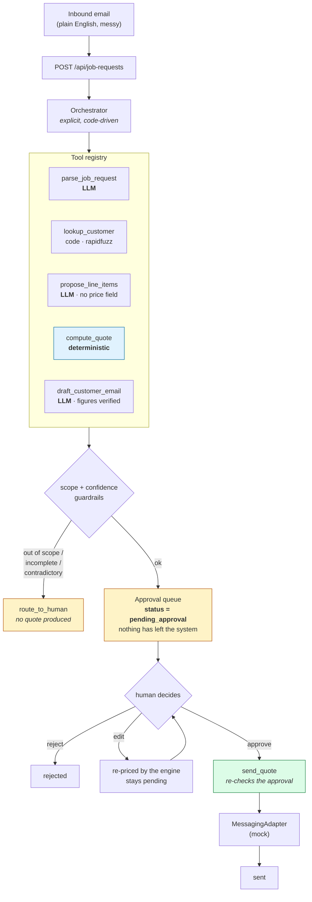

# GroundControl

**An operations copilot for Riverside Grounds** — a landscaping and grounds-maintenance company.
It turns an inbound plain-English job-request email into a priced, drafted quote in minutes, and
**never sends anything to a customer without a human clicking approve**.

> Built as a Forward Deployed Engineer engagement. The writeup — discovery, tradeoffs, results,
> and productionization path — is in [`CASE_STUDY.md`](./CASE_STUDY.md).
> The build plan and phase status are in [`PLAN.md`](./PLAN.md).

---

## The problem

Riverside Grounds runs about 8 crews on roughly $2M a year. Every job request arrives as a
plain-English email or a forwarded voicemail. The office manager reads each one, checks whether
the customer already exists, hand-builds a quote in a spreadsheet, and emails it back. Turnaround
is one to two days. They lose jobs to faster competitors, and they make pricing errors under time
pressure.

GroundControl compresses the drafting step to minutes while keeping the human decision exactly
where it was.

---

## Architecture



**Three commitments hold the design together.**

**The LLM proposes; code decides.** There are exactly three LLM calls — parse the email, propose
services and quantities, draft the customer email. Money, database writes, and sends are pure
Python. `compute_quote` never sees the model.

**Guardrails are structural, not prompted.** `ProposedLineItem` has no price field and forbids
extra keys, so the model cannot name a dollar amount even if it wants to. `send_quote` is not in
the tool registry and `agent/registry.py` does not import it — a test parses that module's imports
via AST to keep it that way. The agent has no send capability to misuse.

**Human-in-the-loop is enforced in three independent places.** The quote state machine makes
`approved` the only status from which `sent` is reachable; `require_approval` re-validates the
approval inside `send_quote` rather than trusting its caller; and a database CHECK constraint
prevents a pending approval row from carrying a decision.

### Stack

| Layer | Choice |
|---|---|
| API | Python 3.12 · FastAPI · Pydantic v2 · SQLAlchemy 2.0 (sync, psycopg3) · Alembic |
| Database | Postgres 16 — money as integer cents, sub-cent rates as Numeric, never float |
| LLM | Official `anthropic` SDK, structured outputs. Model via `LLM_MODEL` |
| Matching | `rapidfuzz` — deterministic and testable, which an LLM would not be |
| Tracing | In-house, into Postgres. Rejected Langfuse: it adds a service and puts traces behind a second UI |
| Web | Next.js 16 (App Router) · TypeScript · Tailwind v4 · shadcn/ui |
| Types | `openapi-typescript` generates `packages/api-types` from the OpenAPI spec |

---

## Quick start

```bash
cp .env.example .env        # then set ANTHROPIC_API_KEY
docker compose up           # postgres + api + web; migrations run on boot
```

- Web UI → http://localhost:3000
- API docs → http://localhost:8000/docs

Then:

```bash
make seed                   # catalog, pricing rules, 40 customers, labeled job requests
make test                   # 263 tests — deterministic, offline, free
make eval                   # 20-case subset
make eval-full              # the whole dataset
```

**On Windows without GNU Make**, use the shim — identical targets:

```powershell
.\make.ps1 seed
.\make.ps1 test
```

Run `make help` for the full target list.

To populate a demo — an approval queue with real quotes and a trace viewer with real runs:

```bash
docker compose exec api python -m scripts.seed --run-pipeline 10
```

That one costs API credit (roughly $0.25 on Sonnet). `make seed` alone costs nothing.

### Ports

Postgres publishes on **5434**, not 5432, because a local Postgres is usually already on 5432.
Override with `POSTGRES_PORT` in `.env`.

---

## Results

<!-- HEADLINE: filled from the eval harness output. See "Status" below. -->

The headline numbers in this section are produced by `make eval-full` and nothing else. No figure
is written here that the harness did not print. The harness writes
`services/api/evals/results/latest.json` and records an `EvalRun` row that the Eval Dashboard
reads.

**Status: not yet measured.** The dataset generator and the eval harness are both complete and
tested, but neither has been run against the real API — see *Known gaps* below.

The bar we set ourselves is checked into [`services/api/evals/thresholds.yaml`](./services/api/evals/thresholds.yaml)
so it is visible before the result is:

| Metric | Threshold |
|---|---|
| Field-level extraction accuracy | ≥ 90% |
| Customer-match accuracy | ≥ 90% |
| Quote total within 10% of expected | ≥ 85% |
| Guardrail pass rate on adversarial cases | ≥ 90% |
| **Hallucinated quotes** | **0 — a count, not a rate** |
| Draft quality checks | ≥ 95% |

---

## What's mocked, and how you'd make it real

This is the honest part. Every integration is behind a `Protocol` in
[`integrations/base.py`](./services/api/integrations/base.py), and
[`integrations/registry.py`](./services/api/integrations/registry.py) is the only place an
implementation is chosen. That file is deliberately small enough to verify at a glance, because
the claim the architecture makes is that swapping one is a one-file change.

| Adapter | Today | To make it real |
|---|---|---|
| **Messaging** | `MockMessagingAdapter` logs the send, returns a provider message id, and the caller writes a `SentMessage` row — the audit trail is identical to a real provider's | Implement `send_email` against Postmark/SendGrid/Resend and return the real message id. Register it in `registry.py`. The approval gate sits above this layer, so a real adapter inherits the same protection. This is the Phase 2 item I would do first, because it is the one that proves the seam. |
| **CRM** | Customer lookup runs against our own Postgres table, seeded from a fixture export of their spreadsheet | Implement `find_customer`/`upsert_customer` against their actual CRM. The fuzzy matcher is independent of the source and would not change. |
| **Calendar** | `MockCalendarAdapter` raises `NotImplementedError` | Crew scheduling is genuinely out of scope for the MVP. The interface is declared so the approval flow has a defined place to hand off an approved job. |
| **Accounting** | `MockAccountingAdapter` raises `NotImplementedError` | Declared for the quote-vs-invoice anomaly detection phase. |

The stubs raise rather than returning plausible empty data on purpose. A stub that silently
returns `[]` is how a half-built integration reaches production by accident.

### Other things that are not production-shaped

- **The pipeline runs synchronously inside the HTTP request.** For a company receiving a few dozen
  requests a day this is the right call — it keeps the request/response model honest and avoids a
  queue the deployment does not need. At real volume this moves to a worker.
- **There is no authentication.** Single-tenant, single-office deployment. The `actor` on an
  approval is a string the frontend supplies; it would become an authenticated identity.
- **Email ingestion is an API call, not an inbox.** Real deployment means an inbound webhook or
  IMAP poller writing to `POST /api/job-requests`.
- **The customer list is a fixture**, generated to include the near-duplicate and name-drift cases
  that make matching non-trivial. Real data will be messier.

---

## Repository layout

```
groundcontrol/
├─ apps/web/              Next.js frontend — pure client, no business logic
├─ services/api/          The only backend
│  ├─ agent/              orchestrator, tools, guardrails, prompts (versioned .md files)
│  ├─ pricing/            deterministic engine + Riverside's price book
│  ├─ integrations/       adapter Protocols + mocks
│  ├─ observability/      tracer + cost accounting (micro-cents)
│  ├─ evals/              harness, metrics, thresholds
│  ├─ db/                 models, migrations, quote state machine
│  └─ fixtures/           labeled dataset, customers, catalog
├─ packages/api-types/    TypeScript types generated from OpenAPI — do not hand-edit
└─ docker-compose.yml     one command
```

### Prompts live in files

`services/api/agent/prompts/*.md`. Not inline string literals, so they diff, review, and blame
like the rest of the code. When an eval number moves, `git log agent/prompts/` says why.

---

## Testing

```bash
make test        # 263 tests
```

Every test is deterministic, offline, and free: the LLM is always `FakeLLMClient`. The suite
covers the pricing engine exhaustively (every rule, both load-bearing rule orderings, all six
refusal codes, reconciliation invariants), the guardrails, the golden path end to end, the API
contract, and the eval scorers themselves.

Tests worth reading first, if you are evaluating this codebase:

- `tests/test_guardrails.py::TestRegistryHasNoSendTool` — the agent has no send capability, asserted structurally
- `tests/test_pricing.py::TestProposalCannotCarryPrices` — the model cannot express a price
- `tests/test_approvals.py::TestSendRequiresApproval` — a queued quote cannot be sent
- `tests/test_evals.py::TestGuardrailScoring` — including a test that an always-route pipeline cannot score well

---

## Known gaps

Stated plainly rather than buried:

1. **The dataset's 180 emails have not been generated, and the eval has not been run.** Both the
   generator (`scripts/generate_dataset.py`) and the harness (`evals/run.py`) are complete, tested,
   and verified mechanically via `--dry-run`. They need an `ANTHROPIC_API_KEY`, which was not
   available in the build environment. The 180 **ground truths** and all 15 **adversarial cases**
   exist as committed fixtures; only the LLM-rendered email bodies for the 180 are missing.
   Running `python -m scripts.generate_dataset --count 180` then `make eval-full` fills this in for
   roughly $6 on Sonnet.
2. **No screenshot or recorded demo**, for the same reason — the approval queue renders correctly
   but has only ever been seen empty.
3. **Mixed-scope requests route to a human rather than quoting the in-scope part.** Deliberate and
   conservative; discussed in the case study as a tunable.
